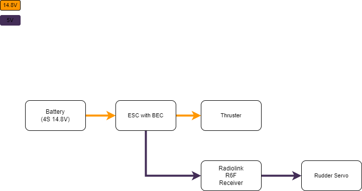
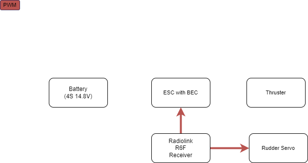
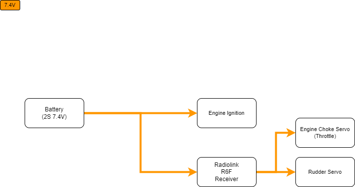
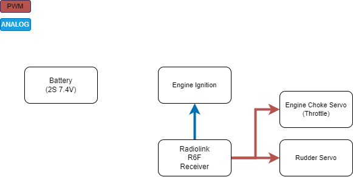

# ERC-FERC-Diagram

### ERC Electrical Diagram

#### Battery: Power source (14.8V)
#### ESC With BEC: Controls the thruster and provides power (5V) via the BEC to other components
#### Radiolink R6F receiver: Receives commands via radio and controls the thruster and rudder
#### Rudder Servo: Moves the rudder to steer the boat
#### Thruster: Provides thrust to move the boat

### ERC Communication Diagram

#### The Radiolink R6F receiver receives commands via radio and controls the thruster and rudder using PWM to move and steer the boat

### FERC Electrical Diagram

#### All components are powered directly from the Battery
#### Battery: Power Source (7.4V)
#### Radiolink R6F receiver: Receives commands via radio and controls the engine choke (throttle) and rudder
#### Engine Ignition: System for starting/stopping the engine
#### Rudder Servo: Moves the rudder to steer the boat
### FERC Communication Diagram

#### The Radiolink R6F receiver receives commands via radio and controls the rudder and engine choke (throttle) using PWM to move and steer the boat
#### It also controls the engine ignition to start/stop the engine
